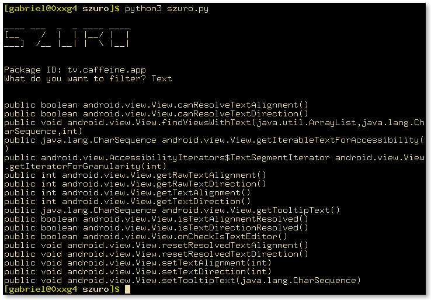

# szuro

android method filter for HACKERS!!!!

## Dependencies

- frida-tools

## Usage

To keep things simple, you need to pass the parameters changing the source code, first you change the `org.mozilla.firefox`
to the app you are hacking (note that the app has to be running). Then, you need to change `Text` to what you want to filter.

## License

Copyright (C) 2020 Gabriel Polastrini

This program is free software: you can redistribute it and/or modify it under the terms of the GNU General Public License version 3, as published by the Free Software Foundation.

This program is distributed in the hope that it will be useful, but WITHOUT ANY WARRANTY; without even the implied warranties of MERCHANTABILITY, SATISFACTORY QUALITY, or FITNESS FOR A PARTICULAR PURPOSE. See the GNU General Public License for more details.
